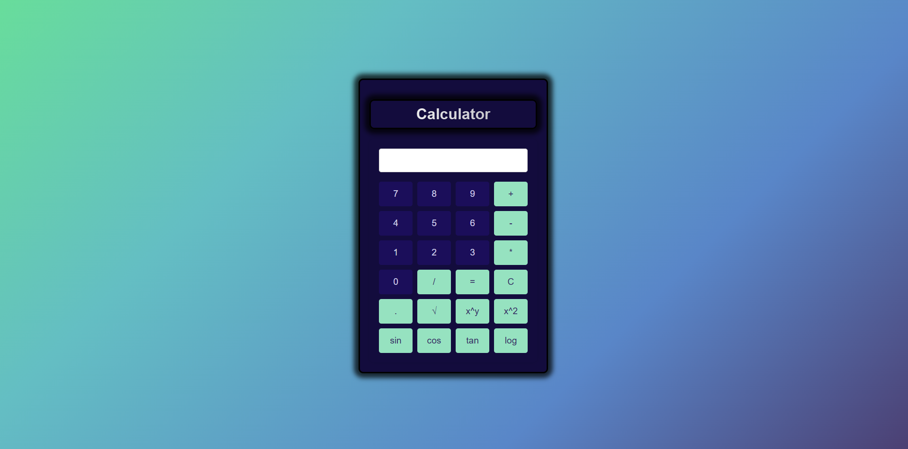

# 🧮 Scientific Calculator

A scientific calculator built using vanilla JavaScript. It supports basic arithmetic operations, trigonometric functions, logarithms, powers, and roots. Built for use in the browser.

---

## Preview
  

---

## 📂 Overview

This project includes logic for basic and advanced calculations. All logic is written in JavaScript and interacts with the HTML `input` display to show results.

---

## 🧠 Full JavaScript Logic

```javascript
let displayValue = '';

// This function adds the inputs pressed to the display bar
function inputDisplay(input){
    displayValue += input;
    updateDisplay();
}

// This function uses the eval method to calculate the text in the display box
function calculate(){
    try {
        const result = eval(displayValue);
        displayValue = result.toString();
        updateDisplay();
    } catch (error) {
        displayValue = 'ERROR';
        updateDisplay();
    }
}

// Function to calculate sine of the value displayed on the calculator
function sin() {
    let value = document.getElementById('display').value; // Get the value from the display
    document.getElementById('display').value = Math.sin(eval(value)); // Calculate sine and update the display
}

// Function to calculate cosine of the value displayed on the calculator
function cos() {
    let value = document.getElementById('display').value; // Get the value from the display
    document.getElementById('display').value = Math.cos(eval(value)); // Calculate cosine and update the display
}

// Function to calculate tangent of the value displayed on the calculator
function tan() {
    let value = document.getElementById('display').value; // Get the value from the display
    document.getElementById('display').value = Math.tan(eval(value)); // Calculate tangent and update the display
}

// Function to calculate common logarithm (base 10) of the value displayed on the calculator
function log() {
    let value = document.getElementById('display').value; // Get the value from the display
    document.getElementById('display').value = Math.log10(eval(value)); // Calculate logarithm (base 10) and update the display
}

// This function uses Math.pow and a user input to calculate the power of the display box
function power() {
    let value = document.getElementById('display').value;
    let power = prompt("Enter power:");
    document.getElementById('display').value = Math.pow(eval(value), power);
}

// This function uses Math.sqrt to find the square root of the display box
function squareRoot() {
    let value = document.getElementById('display').value;
    document.getElementById('display').value = Math.sqrt(eval(value));
}

// This function uses Math.pow to calculate the power of the display box
function square() {
    let value = document.getElementById('display').value;
    document.getElementById('display').value = Math.pow(eval(value), 2);
}

// This function resets the display bar
function clearDisplay(){
    displayValue = '';
    updateDisplay();
}

// This function updates the display box and is used in every function called
function updateDisplay(){
    document.getElementById('display').value = displayValue;
}
```

## ⚙️ How It Works

- Inputs are appended to a global string `displayValue`.
- `updateDisplay()` updates the screen with `displayValue`.
- `calculate()` evaluates the string using JavaScript's `eval()` function.
- Trigonometric, logarithmic, and power functions use built-in JavaScript `Math` methods.

---

## ⚠️ Caution

This calculator uses `eval()` to evaluate string expressions. While convenient for learning and prototyping, `eval()` is **not secure** for production. Avoid using it with unsanitized or user-generated input.

---

## 🛠 Technologies Used

- HTML5  
- CSS3  
- JavaScript (ES6)
